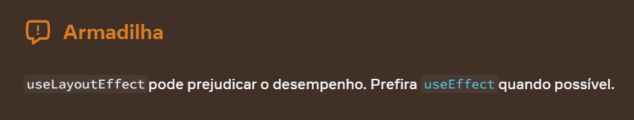

As primeiras coisas que aprendi com React foram sobre Hooks, especialmente `useState` e `useEffect`. No início, porém, eu os utilizava sem entender exatamente como deveria, o que gerou alguns problemas – especialmente com o `useEffect`. Por exemplo, já esqueci de adicionar dependências no `useEffect` e acabei criando um loop infinito.

Naquela época, ninguém me explicou como evitar esses erros, então hoje quero compartilhar algumas dicas para usar o `useEffect` corretamente, especialmente no contexto do ciclo de vida dos componentes.

Neste artigo, vamos explorar como o `useEffect` (e, em alguns casos, o `useLayoutEffect`) pode ser usado para lidar com as etapas do ciclo de vida dos componentes no React: montagem, atualização e desmontagem.

---

## **Primeiro, o que é useEffect?**  
O `useEffect` é um dos hooks do React, e sua principal função é lidar com efeitos colaterais em componentes funcionais.  
Mas você deve estar se perguntando: O que são efeitos colaterais? Eu te explico!
São operações que não estão diretamente relacionadas ao processo de renderização do componente, mas que ainda assim são necessárias. Exemplos comuns incluem chamadas a APIs, atualizações manuais do DOM ou até tarefas de limpeza, como cancelar requisições.


**Como o useEffect funciona?**   
Ele recebe dois parâmetros principais: 
- Uma função de efeito, que contém o código que será executado quando o componente for montado, atualizado ou desmontado.
- Uma array de dependências, que é opcional, e define quando o efeito deve ser executado.

```jsx  
useEffect(() => {
  console.log("O efeito foi executado!");
});
```
---

## **Então, o que é o ciclo de vida no React?**  
O ciclo de vida descreve as fases pelas quais um componente React passa, desde sua criação até sua remoção do DOM. Essas fases podem ser divididas em três momentos principais:  

1. **Montagem (Mounting)**: Quando o componente é adicionado à tela.  
2. **Atualização (Updating)**: Quando algo no componente muda, como estado ou propriedades.  
3. **Desmontagem (Unmounting)**: Quando o componente é removido do DOM.  

---

## **Montagem (Mounting)**  
A etapa de montagem acontece quando o componente é adicionado à página pela primeira vez. Antes da introdução dos hooks, usávamos o método de ciclo de vida `componentDidMount` para executar código logo após o componente ser inserido no DOM.

Com a chegada do `useEffect`, basta passar um array de dependências vazio para simular esse comportamento. O código será executado apenas uma vez, após o componente ser montado.

```jsx  
import React, { useEffect } from 'react';

function MyComponent() {  
  useEffect(() => {  
    console.log('Componente montado!');  
    // Aqui você pode fazer requisições ou configurar eventos.
  }, []);  // Sem dependências, executa apenas na montagem.
  return <div>Hello World</div>;  
}  
```

## **Atualização (Updating)**  
Um componente é atualizado sempre que há uma mudança de estado ( `state`) ou propriedades ( `props`). Antes dos hooks, usávamos métodos como  `componentDidUpdate` para lidar com essa fase. Hoje, o  `useEffect` nos permite monitorar mudanças em variáveis específicas, graças ao array de dependências.

```jsx  
import React, { useEffect } from 'react';

useEffect(() => {  
  console.log('Componente atualizado!');  
}, [data]); // O useEffect será executado toda vez que "data" mudar.
```

* Se não passarmos um array de dependências, o `useEffect` será executado em toda atualização, o que pode levar a comportamentos indesejados.

## **Desmontagem (Unmounting)**  
A etapa de desmontagem ocorre quando o componente é removido do DOM. Antes, utilizávamos o método `componentWillUnmount` para realizar tarefas de limpeza, como remover event listeners ou cancelar requisições.

Agora, usamos o `useEffect` com um retorno dentro da função, que é executado automaticamente durante a desmontagem.

```jsx  
import React, { useEffect } from 'react';

useEffect(() => {  
  const timer = setInterval(() => console.log('Executando...'), 1000);  

  return () => {  
    clearInterval(timer);   // Limpeza realizada ao desmontar o componente
    console.log('Componente desmontado!');  
  };  
}, []);  
```

---

##  **Então useLayoutEffect**  
Assim que você abre a documentação do react você recebe esse aviso:



Ou seja, use-o com cuidado. Com isso em mente, vamos explorar o que é o `useLayoutEffect`!

O `useLayoutEffect` é um hook do React semelhante ao `useEffect`, até mesmo na sua maneira de declaração.  Mas com diferenças importantes em relação ao momento em que o código é executado. Ele é usado para rodar efeitos síncronos antes que o navegador realize a pintura da tela. Isso significa que qualquer alteração feita no DOM dentro do `useLayoutEffect` será aplicada de forma imediata, garantindo que o usuário veja as mudanças antes da próxima atualização visual. 

**Quando você deve usar?**
- **Medir ou modificar o layout do DOM**: Por exemplo, calcular o tamanho ou posição de um elemento antes que o navegador exiba a página.
- **Sincronizar estados ou estilos diretamente com mudanças no DOM**: Especialmente quando alterações dependem de medidas precisas.

**E dentro do Ciclo de vida? Onde ele fica?**  
Dentro do ciclo de vida do React, o `useLayoutEffect` se encaixa principalmente nas fases de montagem e atualização. Ele faz mais sentido nessas etapas, caso você precise garantir que as alterações no DOM sejam aplicadas antes da pintura da tela. A seguir, você verá uma explicação mais detalhada sobre o seu uso nessas fases.

**1. Montagem (Mounting):**
* Quando o componente é montado, o `useLayoutEffect` é executado após a renderização, mas antes da pintura da tela. Isso é útil quando você precisa fazer ajustes no layout ou medir elementos do DOM (como tamanhos ou posições) antes que o usuário veja qualquer alteração.

**2. Atualização (Updating):**
* Durante as atualizações do componente (quando o estado ou as propriedades mudam), o `useLayoutEffect` também é chamado depois da renderização, mas antes da pintura da tela. Se você precisa fazer algo no DOM (como recalcular o tamanho de um elemento ou atualizar um estilo) baseado em mudanças de estado, o `useLayoutEffect`  garantirá que o layout seja ajustado antes que a tela seja renderizada novamente.

---

##  **Armadilhas Comuns e Boas Práticas**  

1. **Evite efeitos sem dependências**: Um useEffect sem dependências será executado em todas as atualizações, o que pode gerar loops infinitos ou degradação de desempenho.

2. **Lembre-se da limpeza em desmontagem**: Sempre retorne uma função de limpeza no useEffect para evitar comportamentos inesperados, como intervalos ou event listeners não removidos.

3. **Utilize o array de dependências corretamente**: Verifique se todas as variáveis usadas dentro do useEffect estão listadas como dependências. O ESLint pode ajudar nisso.

4. **Uso excessivo ou desnecessário**:  O useLayoutEffect é mais pesado do que o useEffect, pois ele é executado sincronamente após todas as mutações do DOM. Isso pode impactar o desempenho, especialmente em componentes com muitos renders. Use-o apenas quando for realmente necessário.

5. **Priorize useEffect sempre que possível:**  Talvez eu esteja sendo repetitiva, mas é importante, eu prometo!  Na maioria das vezes,  useEffect é a escolha ideal para a maioria das operações assíncronas. Use useLayoutEffect apenas quando precisar interagir com o layout do DOM de forma síncrona.

---

##  **Reflexões Finais e Próximos Passos**  

Entender o ciclo de vida de um componente React é essencial, tanto para saber o que você está fazendo quanto para criar aplicações robustas e eficientes. Os hooks useEffect e useLayoutEffect são grandes aliados nesse processo, mas é importante saber quando usar cada um e evitar armadilhas comuns. Ao seguir boas práticas, você assegura que seus componentes sejam bem estruturados e fáceis de manter.
E se bateu dúvida sobre algo? Sua melhor amiga sempre vai ser a documentação.

Versão pt-br (nem tudo foi traduzido): https://pt-br.react.dev/

Versão en: https://react.dev/

**E você, tem alguma dica ou dúvida sobre o ciclo de vida? Sobre `UseEffect` ou `useLayoutEffect`? Deixa nos comentários e vamos trocar ideias!**  